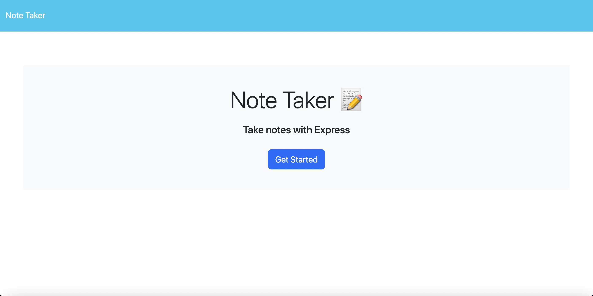
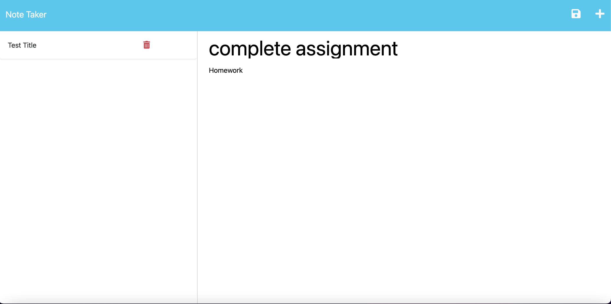

# Take-note

## Description
This is an application called Note Taker that can be used to write and save notes. This application uses an Express.js and will save and retrieve note data from a JSON file
    
## Screenshot

## Table of Contents
* [Installation](#installation)
* [Usage](#usage)
* [License](#license)
* [Contributors](#contributors)
* [Tests](#tests)
* [Questions](#questions)
    
## Installation
N/A

## Usuage
To use the application simply click on the get started at the home page, from there you will be directed to the next page where you would be able to add and save notes.

## License
MIT

## Contributions
Birhanu Mengistu

## Tests
N/A

## Questions

How to reach me:

Github : https://github.com/linotmike

Email : linotmike.mk@gmail.com

## Links

Github repo: https://github.com/linotmike/Take-note

    
